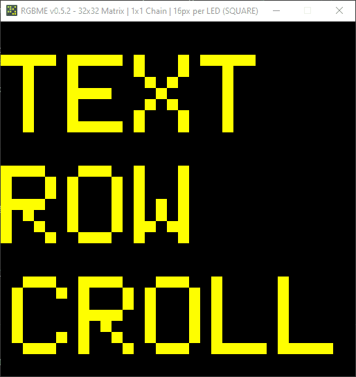

## MatrixML

Matrix ML is a markup language to make composing screens for Raspberry Pi LED matrices simple.

Rather than twiddling with X and Y coordinates for text attributes, creating custom animations, and other tedious work, with MatrixML you can simply use custom matrix tags in markup language format in order to render text and data.

MatrixML comes with a rendering engine that parses the tags and writes the pixel buffer to the Pi matrix via `rpi-rgb-led-matrix`, a common driver library.

:warning: MatrixML is an early work in progress! The API is not yet stable and subject to change at any time. :warning:

### Screenshots



### Installation

Installation is very much a work in progress effort:

```sh
git clone git@github.com:ty-porter/MatrixML.git
```

For now, MatrixML is tested with `RGBMatrixEmulator`, which you can install via `pip`:

```sh
pip install RGBMatrixEmulator
```

Future releases will support actual hardware.

### Supported Tags

* `<text>`
  - A container for static textual data
  - All text must be wrapped in a `<text>` tag
* `<row>`
  - A row container for nested elements
  - Elements within the row are placed on the same row
  - :warning: Currently only supports nested `<text>` tags
* `<scroll>`
  - A scrolling row element that only scrolls if needed
  - :warning: Currently only supports nested `<text>` tags

### Example Markup

This sample can be found in `samples/test.matrix.html`.

```
<text>
  TEXT
</text>
<row>
  <text>
    ROW
  </text>
</row>
<scroll>
  <text>
    SCROLL SCROLL
  </text>
</scroll>
```

### Registering Screens

The main function of `main.py` includes examples of registering screens. Once the MatrixML template is created, create a `MatrixScreen` and register it with the `MatrixScreenManager`. The display is loaded on call to `MatrixScreenManager.process()`, just like you would do for `rpi-rgb-led-matrix` Python scripts.

```python
# main.py

# Main function
if __name__ == "__main__":
    template = "samples/test.matrix.html"
    screen   = MatrixScreen(template)
    manager  = MatrixScreenManager()
    manager.register_screen(screen)

    if (not manager.process()):
        manager.print_help()
```

### Running the Display

```sh
python main.py
```

### Contact

Tyler Porter

tyler.b.porter@gmail.com